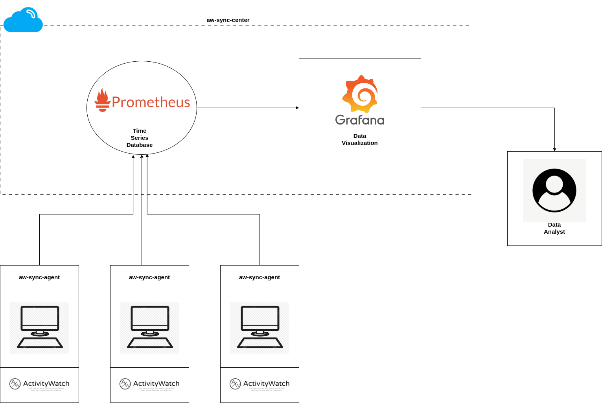
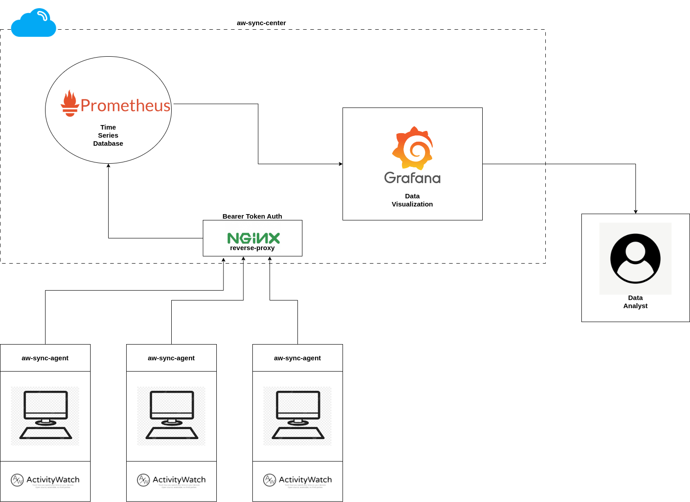

<h1 align="center">Aw-Sync-Suite</h1>
<p align="center">
Open-Source Solution for Securely Syncing and Visualizing Multiple ActivityWatch Instances.  <br>
</p>

<p align="center">

   <a href="https://github.com/phrp720/aw-sync-suite/actions/workflows/tests.yaml?query=branch%3Amaster">
    
  </a>
  <a href="https://github.com/phrp720/aw-sync-suite/actions/workflows/build.yml">
    
  </a>
  <a href="https://github.com/phrp720/aw-sync-suite/actions/workflows/agent-docker-image.yml">
    
  </a>

  <a href="https://github.com/phrp720/aw-sync-suite/releases">
    
  </a>
</p>

<p align="center">
  If you’ve ever wished for <strong> a simple, centralized solution </strong> to sync and visualize data from multiple instances of ActivityWatch, you’re in the right place.

</p>

<details>

<summary>Table of Contents</summary>

1. [About](#about)
2. [Features](#features)
3. [Flow Diagrams](#flow-diagrams)
    - [Without Bearer Token Authentication](#1-sync-suite-without-bearer-token-authentication)
    - [With Bearer Token Authentication](#2-sync-suite-with-bearer-token-authentication)
4. [Quick Start](#quick-start)
    - [Download the Latest Release](#1-download-the-latest-release)
    - [Deploy aw-sync-center (Cloud Setup)](#2-deploy-aw-sync-center-cloud-setup)
    - [Configure and Run aw-sync-agent (On Each Computer)](#3-configure-and-run-aw-sync-agent-on-each-computer)
    - [Visualize in Grafana](#4-visualize-in-grafana)
5. [Components](#components)
    - [aw-sync-agent](#aw-sync-agent)
    - [aw-sync-center](#aw-sync-center)
6. [Requirements](#requirements)
7. [Contributing](#contributing)
</details>

## About
**Aw-Sync-Suite** provides an easy-to-deploy solution for syncing data from multiple [ActivityWatch](https://github.com/ActivityWatch/activitywatch) instances to [Prometheus](https://prometheus.io/) and visualizing the data with [Grafana](https://grafana.com/). 

This project operates independently of **ActivityWatch** and is compatible with all versions of ActivityWatch that support the REST API feature.

### This suite consists of two main components:
- **[aw-sync-agent](https://github.com/phrp720/aw-sync-suite/tree/master/aw-sync-agent):**  A lightweight agent that runs on each computer you want to sync data from. It connects to ActivityWatch, retrieves the data,filter them, and pushes it to Prometheus.
- **[aw-sync-center](https://github.com/phrp720/aw-sync-suite/tree/master/aw-sync-center):** A cloud-based setup containing Prometheus and Grafana for centralized data storage and visualization. It is set up once to handle the aggregation and visualization of data from all agents.

This repository simplifies the deployment and integration process, making it easy to get started with ActivityWatch-based  user analytics.

## Features
- Sync data from multiple ActivityWatch instances to a centralized Prometheus database.
- Visualize the synced data through pre-built Grafana dashboards.
- Simple deployment using Docker Compose for the **aw-sync-center**.
- Modular design: Run the **aw-sync-agent** on each computer where ActivityWatch data is being collected.

## Flow Diagrams


### 1. Sync-Suite without Bearer Token Authentication


### 2. Sync-Suite with Bearer Token Authentication


## Quick Start

### 1. Download the latest Release

Download the latest  aw-sync-suite `.zip` from the [release page](https://github.com/phrp720/aw-sync-suite/releases/) and extract it to a directory.

### 2. Deploy aw-sync-center (Cloud Setup)

Inside the extracted folder, navigate to the `aw-sync-center` directory and run Docker Compose to set up the cloud-based components (Prometheus and Grafana):

    cd aw-sync-center
    docker-compose -f docker-compose-default.yaml up

This will start the necessary services to collect and visualize the data.
> [!IMPORTANT]
> If you want to protect the exposed Prometheus endpoints with Bearer token authentication read more [here](https://github.com/phrp720/aw-sync-suite/tree/master/aw-sync-center#prometheus-with-nginx-secure-setup).
### 3. Configure and Run aw-sync-agent (On Each Computer)

On each computer you want to track ActivityWatch data from, go to the `aw-sync-agent` folder and configure the `aw-sync-agent.yaml` file to specify the Prometheus endpoint and any other settings.

Once configured, you can run the **aw-sync-agent** in one of three ways:

- As an executable: Run the executable directly.
- As a service: Run the executable as a service on Windows or Linux with a single command:
  - Windows: 

  ```cmd
  .\aw-sync-agent.exe -service
   ```
  - Linux: 
    
  ```bash
  ./aw-sync-agent -service
  ````
- As a Docker container: Use the Docker image to run the agent in a container. Here’s an example:
```bash
docker run -v /path/to/aw-sync-agent.yaml:/opt/aw-sync-agent/aw-sync-agent.yaml phrp5/aw-sync-agent:latest
```
> [!CAUTION]
> Make sure to replace `/path/to/aw-sync-agent.yaml` with the path to your configuration file.

> [!Tip]
> - You can find the images of the latest release [here](https://hub.docker.com/r/phrp5/aw-sync-agent/tags).
> - Docker-compose Examples can be found [here](https://github.com/phrp720/aw-sync-suite/tree/master/aw-sync-agent/docker-examples).
> - More information about agent configuration can be found [here](https://github.com/phrp720/aw-sync-suite/tree/master/aw-sync-agent#configuration-options)

### 4. Visualize in Grafana
- Open Grafana.
- Set up Prometheus as a data source
- Import the pre-built dashboards that you can find [here]() to start visualizing the ActivityWatch data.
## Components

### aw-sync-agent

- **Purpose**: Syncs data from ActivityWatch to Prometheus.
- **Deployment**: Run on each computer you wish to track user activity from.
- **Configuration**: Configure it via the `aw-sync-agent.yaml` file.

### aw-sync-center

- **Purpose**: Centralized cloud setup that includes Prometheus and Grafana for monitoring and visualization.
- **Deployment**: Set up once for centralized control and management.
- **Included Services**: Prometheus, Grafana, and necessary dashboards.

## Requirements

- Docker and Docker Compose for easy setup of `aw-sync-center`.
- A running instance of ActivityWatch on the computers you want to monitor.

## Contributing
Contributions are welcomed! If you have ideas, improvements, or bug fixes, feel free to open an issue or submit a pull request.

## Roadmap

### In Progress
- [ ] Grafana dashboard template for data visualization

### Upcoming Features
- [ ] Complete project documentation
- [ ] Publish version 0.1.0 of aw-sync-suite
