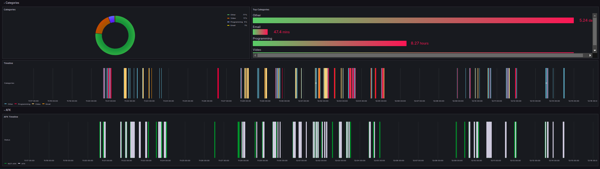

<h1 align="center">Aw-Sync-Suite</h1>

Open-Source Solution for Securely Syncing and Visualizing Multiple ActivityWatch Instances.   

   
  
  

  

  If you’ve ever wished for <strong> a simple, centralized solution </strong> to sync and visualize data from multiple instances of ActivityWatch, you’re in the right place.
  
  📖 For detailed documentation, visit our <a href="https://github.com/phrp720/aw-sync-suite/wiki">GitHub Wiki</a>.

📑 Table of Contents

1. [About](#-about)
2. [Features](#-features)
3. [Installation & Usage](#-installation--usage)
4. [Components](#-components)
    - [aw-sync-agent](#-aw-sync-agent)
    - [aw-sync-center](#-aw-sync-center)
5. [Architecture](#-architecture)
6. [Requirements](#-requirements)
7. [Contributing](#-contributing)
8. [License](#-license)

## 🔍 About
**Aw-Sync-Suite** provides an easy-to-deploy solution on syncing data from multiple [ActivityWatch](https://github.com/ActivityWatch/activitywatch) instances to a centralized [Prometheus](https://prometheus.io/) database with easy visualization in [Grafana](https://grafana.com/).

The project operates independently of **ActivityWatch** and supports all ActivityWatch versions with a REST API.

### 👁️ Preview

|  |  |
|-----------------------------------------------------------------------------|--------------------------------------------------------------------------------|

You can check also the [screenshots](https://github.com/phrp720/aw-sync-suite/tree/master/aw-sync-center/grafana/dashboards/screenshots) for more insights.

## 🌟  Features
- 🌐 **Centralized Monitoring:** Aggregate data from multiple devices effortlessly.
- 🛡️ **Data Filtering:** Protect sensitive information by filtering or sanitizing it at the source.
- 📍 **Checkpointing Mechanism:** Smart synchronization with automatic tracking of synced data.
-  📈 **Pre-Built Dashboards:** Use intuitive Grafana dashboards for instant insights.
- ⚙️ **Effortless Deployment:** Simple setup for both agent and central components.

## 🚀 Installation & Usage

Downloads are available on the [releases page](https://github.com/phrp720/aw-sync-suite/releases).

For instructions on how to get started, please see the [guide in the documentation](https://github.com/phrp720/aw-sync-suite/wiki/Installation-Guide).

## 🧩 Components

### 📦 [aw-sync-agent](https://github.com/phrp720/aw-sync-suite/tree/master/aw-sync-agent)

Runs on each device, retrieves and filters ActivityWatch data, and sends it securely to Prometheus via remote-write.

- **Purpose**: Syncs data from ActivityWatch to Prometheus.
- **Deployment**: Run on each computer you wish to track user activity from.
- **Configuration**: Configurable via the `aw-sync-agent.yaml` file.

| Platform Support | Runs as a Service (`-service`) | General Workability |
|------------------|--------------------------------|---------------------|
| **Windows**      | ✅                              | ✅                   |
| **Linux**        | ✅                              | ✅                   |
| **macOS**        | ❌                              | ✅                   |

> [!Note]
> - The **aw-sync-agent** is fully operational on **macOS**, but the `-service` feature (which allows the agent to run as a background service) is not yet implemented for macOS.
> - On macOS, you can still manually start and run the agent to sync ActivityWatch data without issues.

### 📦 [aw-sync-center](https://github.com/phrp720/aw-sync-suite/tree/master/aw-sync-center)

A centralized Prometheus and Grafana setup for aggregating and visualizing data.

- **Purpose**: Centralized cloud setup that includes Prometheus and Grafana for monitoring and visualization.
- **Deployment**: Set up once for centralized control and management.
- **Included Services**: Prometheus, Grafana, and necessary dashboards.
 
## 📊 Architecture

Sync-Suite contains two available setups: one **without Bearer Token Authentication** and another **with Bearer Token Authentication**.

The latter provides an additional layer of security by securing the Prometheus endpoints with a Bearer token if it is exposed to the internet.
This setup uses a Nginx reverse proxy to secure the Prometheus endpoints.

| Without Bearer Token Authentication 🔓      | With Bearer Token Authentication 🔐                     |
|---------------------------------------------|---------------------------------------------------------|
|  |  |

## 🛠️ Requirements

- Docker and Docker Compose for easy setup of `aw-sync-center`.
- A running instance of ActivityWatch on the computers you want to monitor.

## 👥 Contributing
Contributions are welcomed! If you have ideas, improvements, or bug fixes, feel free to open an issue or submit a pull request.

## 📝 License

This project is licensed under the **MIT license**.

See [LICENSE](https://github.com/phrp720/aw-sync-suite/blob/master/LICENSE) for more information.
